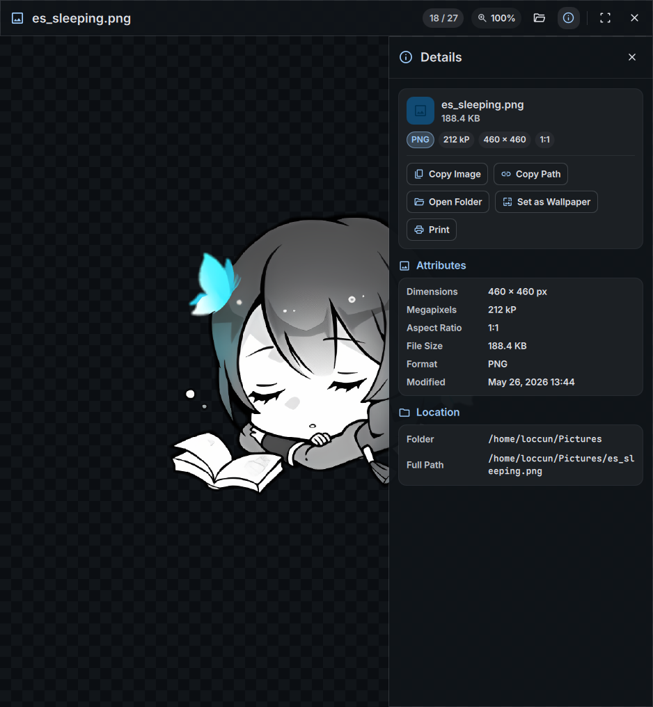

# DankView (`dview`)

Image viewer for DankMaterialShell, inspired by GNOME Loupe.

<p align="center">
  
  
</p>


## Keyboard Shortcuts

| Shortcut | Action |
|---|---|
| `Right` / `Space` / `PageDown` | Next image |
| `Left` / `Backspace` / `PageUp` | Previous image |
| `+` / `=` / `Wheel Up` | Zoom in |
| `-` / `Wheel Down` | Zoom out |
| `0` | Fit to window (best fit) |
| `Ctrl + 1` | Actual size 100% (1:1 pixel scale) |
| `Double Click` | Toggle 200% zoom / 100% fit |
| `r` / `Shift + r` | Rotate clockwise / counter-clockwise (90°) |
| `Ctrl + M` / `h` | Flip horizontally |
| `v` | Flip vertically |
| `f` / `F11` | Toggle maximize / fullscreen |
| `Ctrl + O` | Open image dialog |
| `i` | Toggle EXIF inspector |
| `Ctrl + C` | Copy image to clipboard |
| `Delete` | Move image to trash (`gio trash`) |
| `Ctrl + Z` | Undo trash (restore last trashed image) |
| `Esc` | Close inspector / restore window / quit |

## CLI Usage

```bash
dview photo.jpg                  # Open image
dview -f photo.jpg               # Open in fullscreen
dview -info photo.jpg            # Print EXIF metadata JSON (headless)
dview -list /path/to/folder      # List directory images JSON (headless)
dview -v                         # Print version
```

## Build & Install

### Dependencies

- Go 1.21+
- [Quickshell](https://quickshell.outfoxxed.me/)

### Commands

```bash
# Build binary
make dev

# Run
make run <image>

# Run tests
make test

# Install
sudo make install PREFIX=/usr/local
```

## License

MIT

