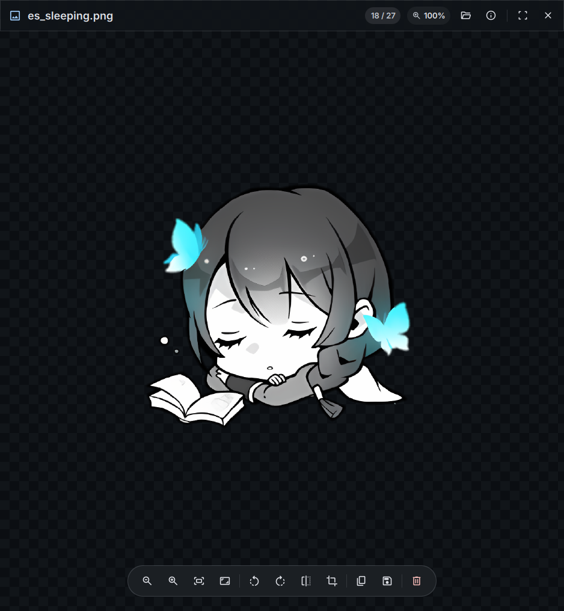

# DankView (`dview`)

Image viewer for DankMaterialShell, inspired by GNOME Loupe.

<p align="center">
  
  
</p>


## Keyboard Shortcuts

| Category | Shortcut | Action |
|---|---|---|
| **Navigation** | `Right` / `Space` / `PageDown` | Next image |
| | `Left` / `Backspace` / `PageUp` | Previous image |
| **Zoom & View** | `+` / `=` / `Wheel Up` | Zoom in |
| | `-` / `Wheel Down` | Zoom out |
| | `0` | Fit to window (best fit) |
| | `1` / `Ctrl + 1` | Actual size (1:1 pixel scale) |
| | `Double Click` | Toggle 200% zoom / fit |
| **Transform** | `r` | Rotate clockwise (90°) |
| | `l` / `Shift + r` | Rotate counter-clockwise (90°) |
| | `h` / `m` / `Ctrl + M` | Flip horizontally |
| | `v` | Flip vertically |
| **Actions** | `c` / `Ctrl + C` | Copy image to clipboard |
| | `x` / `Ctrl + X` | Toggle Crop tool |
| | `s` / `Ctrl + S` | Save As / Export image |
| | `p` / `Ctrl + P` | Print image |
| | `w` / `Ctrl + W` | Set as wallpaper |
| **File & Trash** | `o` / `Ctrl + O` | Open image dialog |
| | `d` / `Delete` | Move image to trash (`gio trash`) |
| | `u` / `z` / `Ctrl + Z` | Undo trash (restore last trashed image) |
| **Window & UI** | `f` / `F11` | Toggle maximize / fullscreen |
| | `i` | Toggle EXIF inspector |
| | `k` / `Tab` | Toggle Lock UI / Clean View (hide all controls) |
| | `Esc` | Close dialog / exit crop / close inspector / unlock UI / quit |

## CLI Usage

```bash
dview photo.jpg                  # Open image
dview -f photo.jpg               # Open in fullscreen
dview -info photo.jpg            # Print EXIF metadata JSON (headless)
dview -list /path/to/folder      # List directory images JSON (headless)
dview -v                         # Print version
```

## Build & Install

### Dependencies

- Go 1.21+
- [Quickshell](https://quickshell.outfoxxed.me/)

### Commands

```bash
# Build binary
make dev

# Run
make run <image>

# Run tests
make test

# Install
sudo make install PREFIX=/usr/local
```

## Credits & Acknowledgements

Special thanks to the community members who helped shape the design and conception of DankView:

- **Zurvan** (Discord) — Core design inspiration and UI concepts.
- **Stumbling** (Discord) & **bbedward** — Invaluable feedback, critique, and quality insights.

## License

MIT

